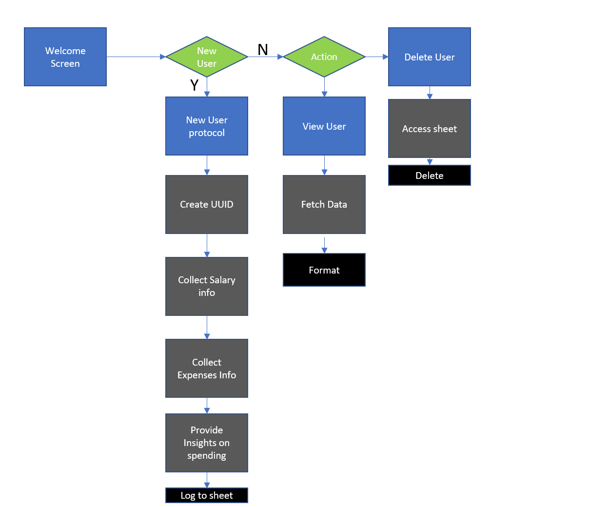

Welcome USER_NAME,

This is the Code Institute student template for deploying your third portfolio project, the Python command-line project. The last update to this file was: **August 17, 2021**

## Reminders

* Your code must be placed in the `run.py` file
* Your dependencies must be placed in the `requirements.txt` file
* Do not edit any of the other files or your code may not deploy properly

## Creating the Heroku app

When you create the app, you will need to add two buildpacks from the _Settings_ tab. The ordering is as follows:

1. `heroku/python`
2. `heroku/nodejs`

You must then create a _Config Var_ called `PORT`. Set this to `8000`

If you have credentials, such as in the Love Sandwiches project, you must create another _Config Var_ called `CREDS` and paste the JSON into the value field.

Connect your GitHub repository and deploy as normal.

## Constraints

The deployment terminal is set to 80 columns by 24 rows. That means that each line of text needs to be 80 characters or less otherwise it will be wrapped onto a second line.

-----
Happy coding!

---

# Finance Health Manager

## About

### Background

I decided to create this project as given the ongoing cost of living crisis facing the country. A finance manager felt like the right project to make.

### Purpose

The Finance health manager will enable users to create a user profile and calculate take home pay in addition to receiving insights on where salary is wasted currently and promote positive spending habits. The terminal application features a salary calculator, insights calculator, allows users to view previous queries and delete unwanted users and all data from persistent sheets storage.

## 

## Technologies

- VS Code: IDE used to develop the site
- Git: used for version control of the website and creating a local repo.
- GitHub: used as a remote repo to store the commits of the project in a place that can be shared.
- GitHub Pages: part of GitHub used to host the website file and create a live project
- MS Word: used to spell check content and remove typos
- Google Fonts: used to import the Roboto font for use in website theme
- art python library: for ascii art
- Python: to develop terminal features
- autopep8: to auto format python code

## Design

### Flow diagram

- flow diagram was created to visualise flow of terminal app and assist with identifying required helper functions

- Flow was largely committed to through the whole development process resulting in streamlined development

## Features

- Prompts 
 - included to prompt user how to interact with terminal
 - prompts are included for all inputs
 - artificial delays are included to enable users to read prompts and have immersive UX

- Ascii art
 - title card written in ascii art to help with rustic aesthetic of terminal app

## Calculations

calculations for take home pay were calculated with reference to [this website](https://www.wikijob.co.uk/finance/pay-salary/calculate-take-home-salary#how-to-calculate-your-take-home-salary)

Calculation steps are included in python DOCSTRINGS

Key values are stored in the sheets database

## Testing

All Python code passes through PEP8 validator with no major errors autopep8 was installed and ran to format code.

Tested various inputs manually to ensure robust input validation - no errors detected during testing

## Bugs

- Heroku Deploy: when deploying on Heroku an error was encountered with the build and caused development to initially fail. Cause was found to be redundant dependency, which was removed

- Validation loop - using the while loop for validation caused infinite loop of input requests. updating while loop expression resolved issue.

- Terminal size: initial deploy of website did not fit on site. Code was reformatted to ensure properly spaced code.

## Credits

code Institute - provided template to complete project and have web based terminal front end.

Rubien - Mentor provided guidance to navigate project scope